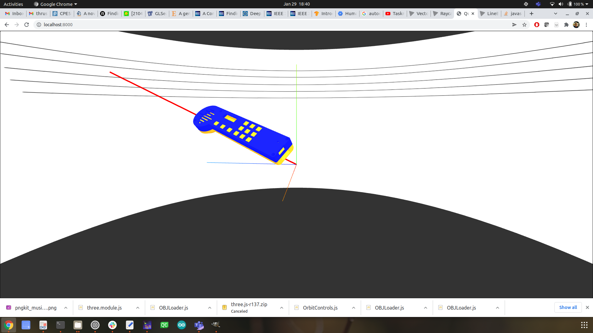

## Gravitone Visualization
A visualization tool for the Gravitone.



This example uses THREE.js for 3D rendering a model of the Gravitone and providing a visual representation for orientation of the device. The javascript modules provided by THREE.js are best served from a CDN, which this example utilizes. Offline configuration is also possible.

To serve the web interface locally, you can use NPM and install ```http-server``` or a Python hosted simple web-server with ```python3 -m http.server```  as orszaczky describes [here](https://stackoverflow.com/questions/18586921/how-to-launch-html-using-chrome-at-allow-file-access-from-files-mode).

Data from the Gravitone is received over a locally hosted websocket server. For initial development there is a python program that blindly reads serial port data and rebroadcasts it over a websocket server. It is located in the scripts folder, run it with ```python3 sertoweb.py /path/ttyACM0``` or with the appropriate COM port in Windows.